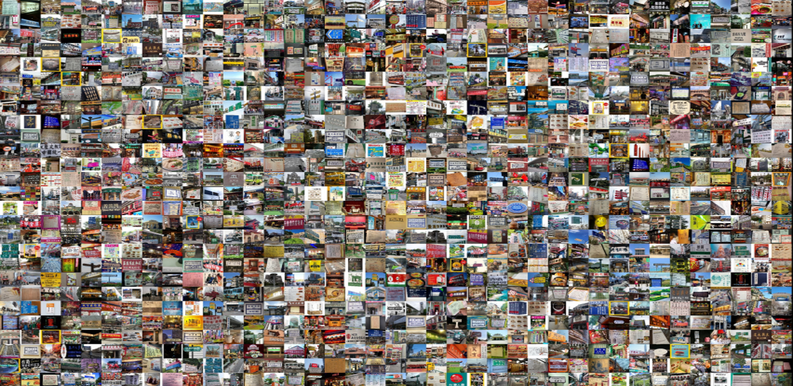
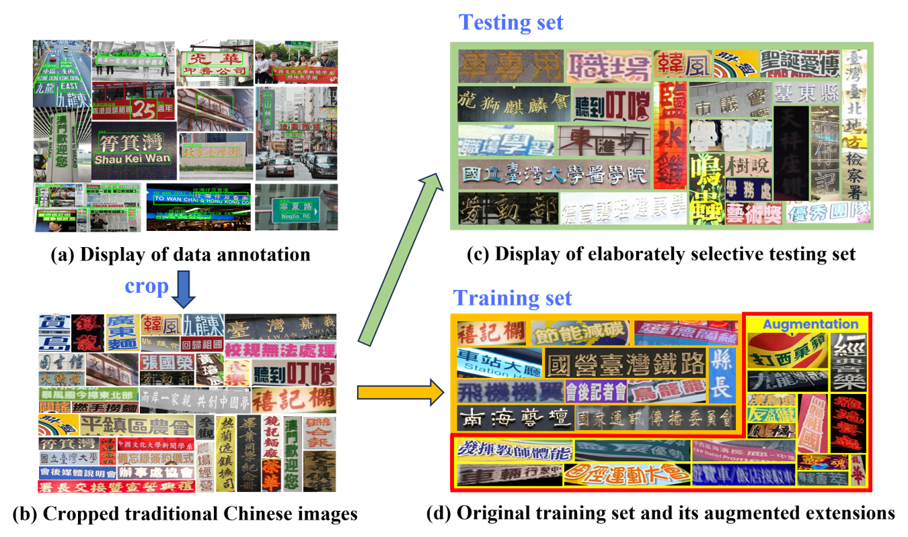
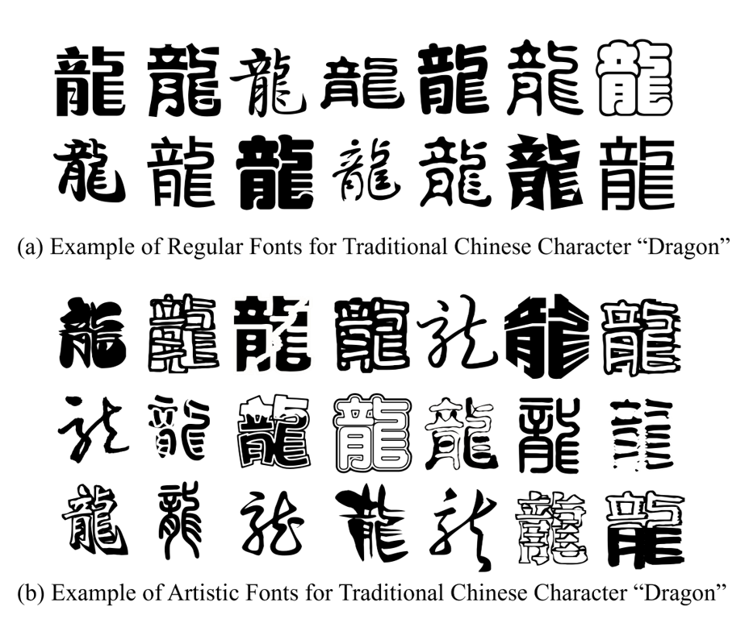
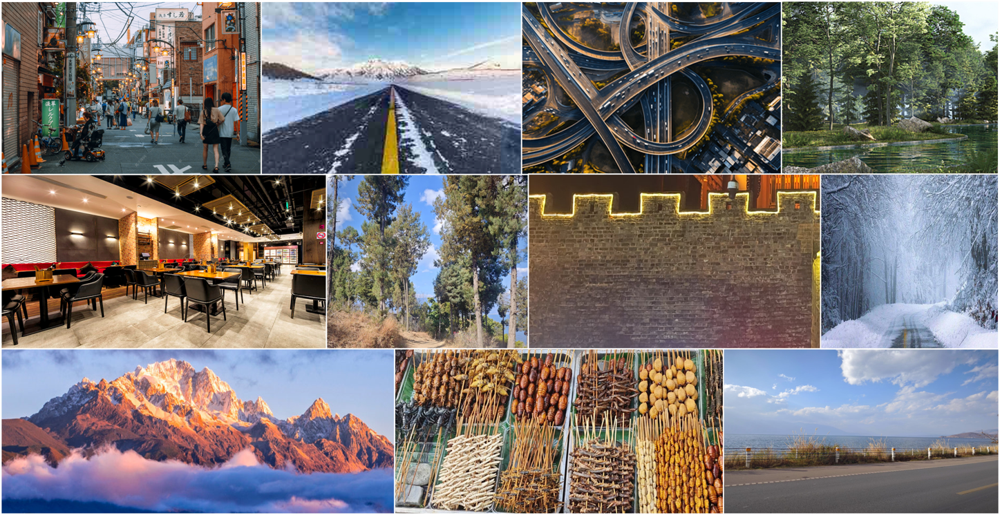
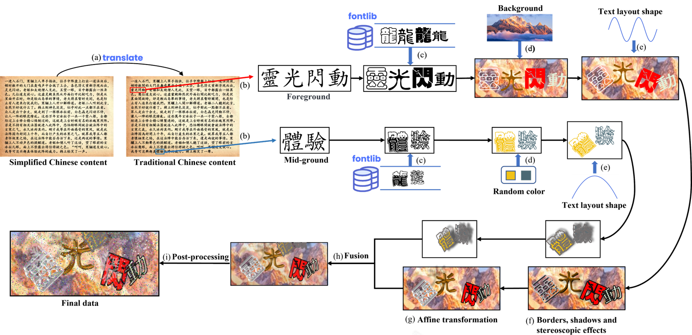

# Large Scene Traditional Chinese Dataset (LSTC)
In order to fill the gap in scene traditional Chinese (Trd-CN) recognition field, we provide a Large Scene Traditional Chinese dataset (LSTC) in complex scenes, including a real scene dataset with 606,849 images with comprehensive Trd-CN annotations and a synthetic scene dataset. Over 3.5 million quantities and over 6 thousand varieties of Trd-CN character data in LSTC real scene part has far exceeded all existing scene text datasets. We have specifically designed a process for generating LSTC synthetic scene part, with the aim of addressing the glyph and distribution characteristics of Trd-CN. Our synthetic scene dataset contains 800,000 images, which have wide scenes, extensive Trd-CN coverage and strong font diversity. LSTC will be open sourced after the corresponding paper review is completed. The title of the paper is **_A Large Scene Traditional Chinese Recognition Dataset with Complicated Glyph Exploration Framework_**, and it contains detailed data analysis and synthesis process.

## Real Scene Dataset Part

We collected 10,725 images are mainly collected from Taiwan, HongKong, Macau, and Chinese communities overseas. These images cover a diverse range of over 12 scene categories, including but not limited to plaques, signs, menus, newspapers, posters, banners, news, road signs, advertisements, magazines, ancient books and packaging, etc. The scenarios are comprehensive and have a wide range of applications.. We labeled a total of 107,573textlines, of which elaborately selected 21,243 lines formed the testing set. And after training data augmentation, we have a total of 585,606 training text lines, containing a total of 3,737,727 character instances with 6,022 unique characters. The text images contain complex features such as tilt, warping, distortion, low brightness, occlusion, uneven illumination, vertical text, etc. Below, we will provide a detailed introduction to the generation process of the real scene dataset part.

## Synthetic Scene Dataset Part

​We have designed a comprehensive synthetic scene data generation process based on the characteristics of real scene part and Trd-CN glyph shapes. Our synthetic scene dataset focuses on supplementing the data volume for char acters that occur less frequently in real scene dataset part. For this purpose, we construct a corpus, a Co-occurrence Matrix Mediated Score, a font library and a background image library. The corpus is mainly sourced from Sim-CN content collected from the internet, such as novels and classical poetry. We translate this Sim-CN con tent into Trd-CN and use it for generating the synthetic scene dataset. The Co-occurrence Matrix Mediated Score (CMM-Score) to quantitatively assess whether randomly sampled text segments can effectively supplement low-frequency characters in real scene dataset. Our font library includes nearly forty different fonts, which includes regular fonts such as Fangzheng font, Microsoft font, Source Han Sans, etc, as well as artistic fonts like calligraphy font, seal font, cartoon font and so on. The structural complexity and significant variation in stroke composition of artistic fonts present considerable challenges for processing and recognition. The inclusion of a wide variety of font types and forms significantly enhances the diversity and adaptability of the synthetic scene dataset. Our background image library comprises over two hundred complex background images, covering a wide range of scenarios such as streets, forests, beaches, ancient city walls, highways, restaurants, food, and rainy or snowy weather conditions. 

